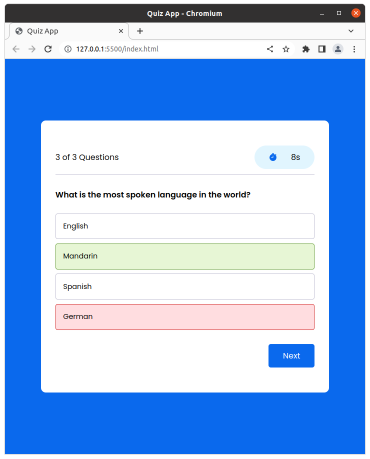
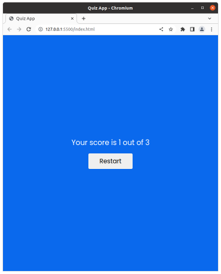
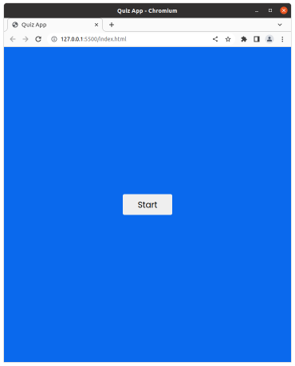
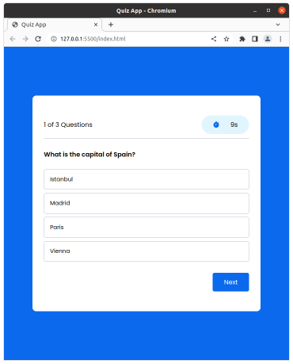

# Mini Proyecto de Quiz App en JavaScript

Este proyecto es un simple juego de preguntas y respuestas implementado en JavaScript puro, HTML y CSS. Los usuarios pueden responder a una serie de preguntas y recibir una puntuación al final del juego.

## Características

El proyecto incluye las siguientes funcionalidades:

- Pantalla de inicio desde la cual los usuarios pueden comenzar el juego.
- Un contador de tiempo que se actualiza por cada pregunta.
- Las preguntas se muestran una a la vez, y los usuarios pueden seleccionar una opción de respuesta de entre las cuatro disponibles.
- Al final del juego, se muestra una pantalla con la puntuación total del usuario.
- Opción para reiniciar el juego y comenzar de nuevo.

## Estructura del Código

- El archivo JavaScript maneja la lógica del juego. Crea preguntas de la base de datos de preguntas (quizArray), muestra y oculta preguntas, verifica respuestas, mantiene un contador de tiempo, actualiza las puntuaciones y manipula el DOM para mostrar y ocultar distintas partes del juego.
- El código JavaScript es muy interactivo y utiliza varias funciones de manipulación del DOM para gestionar la interfaz del usuario.

## Prueba el Juego

Para probar el juego, simplemente ve a la página de demostración alojada en GitHub Pages haciendo click en el siguiente enlace:

* https://pablospata.github.io/quiz-app-js/